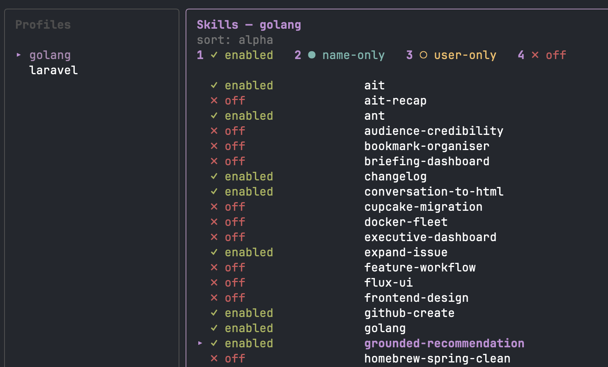

# csp: claude skill profiles

A small CLI and TUI for managing Claude Code skill exposure on a per-project basis.

Define a named profile once (which skills are enabled, name-only, user-invocable-only, or off) and apply it to any project with a single command. `csp` writes the matching `skillOverrides` block to that project's `.claude/settings.local.json` and leaves every other top-level key alone.



## What it does

If you use Claude Code with a lot of skills installed, you've probably noticed that different projects want different sets exposed. A Laravel project wants `flux-ui` and `modern-livewire` but not `golang`. A Go project wants `golang` but not `larastan`. Toggling these by hand in `.claude/settings.local.json` every time you switch projects is tedious.

`csp` lets you save a named profile (`laravel`, `golang`, `sysadmin`, whatever) with your preferred skill states, then apply it with `csp apply laravel` in any project directory. Profiles are plain YAML files in `~/.config/csp/profiles/`, so they're easy to read, hand-edit, or commit alongside a `.claude/` directory if you want to.

## The four states

Claude Code exposes a skill in one of four ways. `csp` works in the same four states:

| State | What Claude sees |
|---|---|
| `enabled` | Full name and description; Claude may invoke autonomously |
| `name-only` | Name only, no description; Claude knows it exists but won't pull it in unprompted |
| `user-invocable-only` | Invisible to Claude; the user can still trigger it via `/skill-name` |
| `off` | Disabled completely |

## Prerequisites

- [Go](https://go.dev/) 1.24+ if you're building from source
- [Claude Code](https://claude.com/claude-code) installed (csp manages its skill exposure settings)

## Installation

Pre-built binaries for Linux, macOS and Windows live on the [releases page](https://github.com/ohnotnow/claude-skill-profiles/releases/latest).

Or install from source:

```bash
go install github.com/ohnotnow/claude-skill-profiles@latest
```

The binary is called `csp`.

## Quick start

Open the TUI:

```bash
csp
```

Press `n` to create a profile. It seeds from your existing `~/.claude/settings.json` so you start from your current state, not a blank slate. Then `1`/`2`/`3`/`4` sets the state and advances to the next skill, `tab` cycles one skill through the four states without advancing, and `a` followed by a digit bulk-sets every visible skill at once. There's no save key; changes hit the YAML file immediately.

When the profile looks right, drop into a project and run:

```bash
csp apply laravel
```

That writes the profile's `skillOverrides` to `./.claude/settings.local.json`.

## Commands

| Command | What it does |
|---|---|
| `csp` | Open the TUI (the main way to edit profiles) |
| `csp list` | List available profiles |
| `csp new <name>` | Create a profile seeded from your current global config |
| `csp show <name>` | Print a profile's skills grouped by state |
| `csp diff <name>` | Show what `csp apply <name>` would change in the current directory |
| `csp apply <name>` | Write the profile to `./.claude/settings.local.json` |
| `csp edit <name>` | Open the profile YAML in `$EDITOR` (escape hatch) |
| `csp version` | Print the version and check for updates |

## TUI keybindings

**Profile pane (left):**

| Key | Action |
|---|---|
| `↑` `↓` / `j` `k` | Navigate profiles |
| `tab` / `→` | Switch to the skill editor |
| `n` | New profile (seeded from current global config) |
| `a` | Apply highlighted profile to the current directory |
| `e` | Open profile in `$EDITOR` |
| `d` | Delete profile (with confirm) |
| `r` | Reload from disk |
| `q` | Quit |

**Skill editor (right):**

| Key | Action |
|---|---|
| `↑` `↓` / `j` `k` | Navigate skills |
| `1` `2` `3` `4` | Set state to enabled / name-only / user-only / off, then auto-advance |
| `tab` / `shift+tab` | Cycle current skill through states without advancing |
| `a` then `1`/`2`/`3`/`4` | Bulk-set every visible skill to that state |
| `/` | Filter skills by name (case-insensitive substring match) |
| `s` | Toggle sort (alphabetical / by state) |
| `esc` / `←` | Back to profile pane |

The `a`+digit bulk action respects the active filter. So `/laravel` then `a4` will set every `laravel-*` skill to `off` and leave everything else alone.

## Configuration

Profiles live in `$XDG_CONFIG_HOME/csp/profiles/*.yaml` (or `~/.config/csp/profiles/` if `XDG_CONFIG_HOME` isn't set). Each profile is a plain YAML file:

```yaml
skills:
  ait: "enabled"
  flux-ui: "enabled"
  docker-fleet: "off"
  audience-credibility: "name-only"
  purchase-order: "user-invocable-only"
```

Skill discovery walks `~/.claude/skills/`. Plugin-provided skills are out of scope (see below).

## What's not supported

- **Plugin skills.** Only `~/.claude/skills/` is scanned; plugin skill exposure stays untouched. Partly a scope decision, partly because I find the plugin management UX fiddly enough that I don't really lean on it day-to-day.
- **Merging.** `csp apply` replaces the whole `skillOverrides` block in `settings.local.json`. Other top-level keys are preserved verbatim, but any hand-rolled `skillOverrides` entries are gone after apply. Run `csp diff` first if you want a preview.
- **Key-order preservation.** Top-level keys in `settings.local.json` get alphabetised by Go's JSON encoder. The first apply may shuffle key order; subsequent applies are stable.

## Running tests

```bash
go test ./...
```

Around 30 unit tests covering YAML round-tripping, skill discovery, settings I/O, version comparison and profile storage. The TUI itself isn't unit-tested; it's small enough to check by running it.

## Contributing

Clone, run tests, send a PR. Issues are welcome too.

```bash
git clone https://github.com/ohnotnow/claude-skill-profiles
cd claude-skill-profiles
go test ./...
go build -o csp .
```

## Licence

MIT. See [LICENSE](LICENSE).
